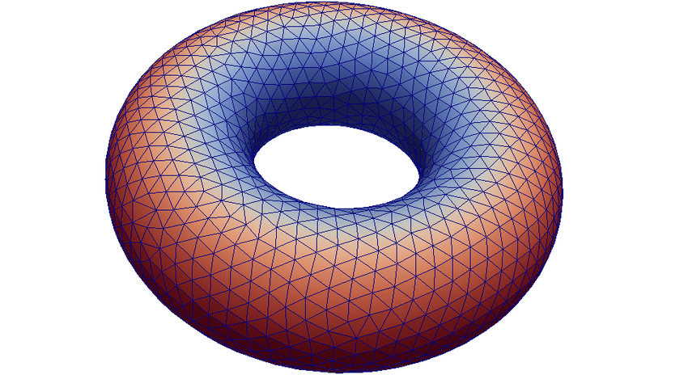
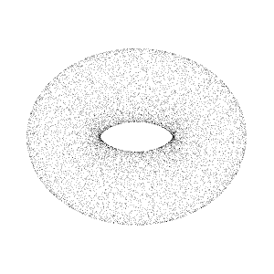

# Path to 3D-Vision
The repository involves my path into **Machine Learning with 3D Vision**.
## Basics
### Mesh

A 3D mesh is the structural build of a 3D model consisting of polygons. 3D meshes use reference points in X, Y and Z axes to define shapes with height, width and depth.

### Point Cloud

A point cloud is a set of data points in space. The points may represent a 3D shape or object. Each point position has its set of Cartesian coordinates. 